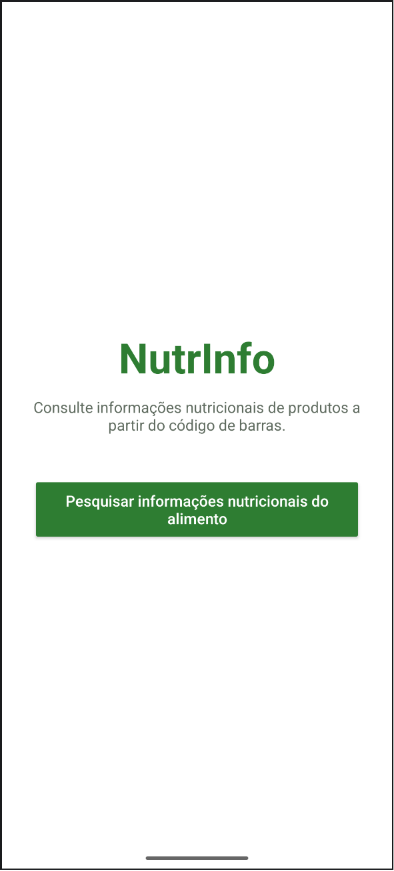
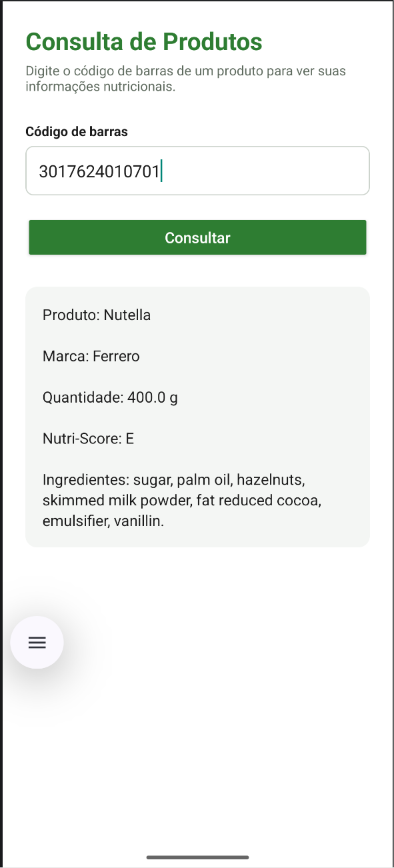
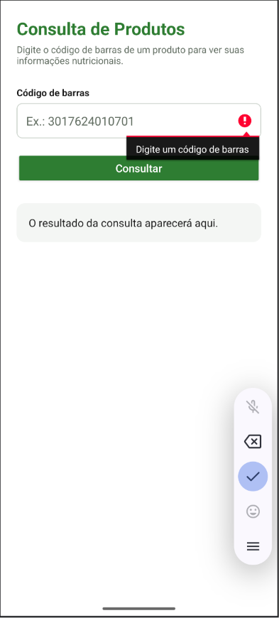
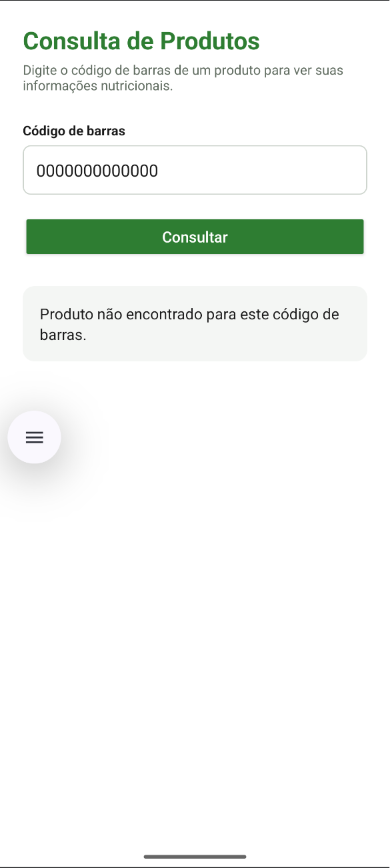

# NutrInfo - Consulta de Informações Nutricionais (API Open Food Facts)

## Descrição
Aplicativo Android que consulta informações de produtos alimentícios a partir do
código de barras. O app é composto por duas telas: uma tela inicial de
apresentação e a tela de consulta. Na consulta, o usuário digita o código de
barras de um produto e o app exibe nome, marca, quantidade, Nutri-Score e
ingredientes, consumindo a API pública do Open Food Facts. Resolve o problema de
consultar rapidamente dados nutricionais e de composição de um produto sem
precisar procurar manualmente.

## Telas
- **Tela inicial (NutrInfo):** apresenta o app e um botão que leva à consulta.
- **Tela de consulta:** campo para o código de barras, botão de busca e exibição
  do resultado.

A navegação entre as telas é feita por `Intent`.

## API utilizada
- Nome da API: Open Food Facts
- Endpoint utilizado: `https://world.openfoodfacts.org/api/v2/product/{barcode}`
- Exemplo de URL consultada: `https://world.openfoodfacts.org/api/v2/product/3017624010701?fields=product_name,brands,quantity,nutrition_grades,ingredients_text`
- Principais dados retornados: nome do produto, marca, quantidade, Nutri-Score
  (nutrition_grades) e lista de ingredientes.

### Códigos de barras para teste
Produtos com cadastro completo na base para utilizar como exemplo:
- `3017624010701` — Nutella (Ferrero)
- `7622210449283` — Oreo
- `5449000000996` — Coca-Cola

> Observação: a base do Open Food Facts é colaborativa. Produtos regionais ou pouco
> cadastrados podem retornar dados incompletos. Por isso o app exibe "Não informado"
> quando um campo não existe, em vez de quebrar.

## Funcionalidades
- Tela inicial de apresentação com navegação para a consulta
- Entrada de dados pelo usuário: código de barras
- Validação de campo vazio
- Consulta à API pública
- Exibição dos dados retornados
- Tratamento de erro diferenciado:
  - campo vazio ("Digite um código de barras")
  - produto não encontrado para código válido (status 0 com HTTP 200)
  - código em formato inválido ou erro do servidor (resposta HTTP de erro)
  - falha de conexão (servidor não responde)

## Tecnologias utilizadas
- Kotlin
- Android Studio
- XML
- Navegação entre Activities (Intent)
- Volley (biblioteca de requisição HTTP)
- API pública Open Food Facts

## Permissões utilizadas
O aplicativo utiliza a permissão INTERNET para realizar requisições à API pública.

```xml
<uses-permission android:name="android.permission.INTERNET" />
```

## Como executar o projeto
1. Clonar este repositório.
2. Abrir o projeto no Android Studio.
3. Aguardar a sincronização do Gradle.
4. Executar o app em um emulador ou dispositivo físico.
5. Na tela inicial, tocar no botão para abrir a consulta.
6. Informar um código de barras válido e realizar a consulta.

## Prints do aplicativo

### Tela inicial


### Tela de consulta


### Consulta com resultado


### Consulta com campo vazio


### Consulta com código de barras inválido



## Autor
Igor Duarte de Oliveira Almeida